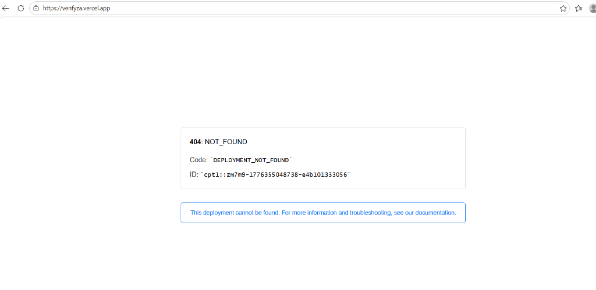

# 🇿🇦 SizweOS

### National Infrastructure Intelligence & Sovereign Operating System

**SizweOS** is an enterprise-grade, national intelligence platform designed for the sovereign management of South African infrastructure, municipal services, and economic health. By fusing real-time citizen signals with predictive AI modeling, SizweOS provides a unified "National Common Operating Picture" for government, municipalities, and the private sector.

---

## 🚀 The Mission
SizweOS transitions national governance from **Reactive Crisis Management** to **Sovereign Predictive Resilience**. It is built to solve the "Trust Deficit" by providing absolute transparency, automated accountability, and high-fidelity situational awareness for all South Africans.

## 🏛️ System Core Modules

### 1. 📊 Sizwe Intelligence Cockpit
The primary executive command center. Monitor national infrastructure vitals, track multi-agency service delivery KPIs, and visualize regional risk clusters in a high-density, data-rich interface.

### 2. 📡 National Fusion Layer (NFL)
A real-time intelligence hub that aggregates data from citizen reports (MuniFix), sensors, and simulated digital shadows. Predict infrastructure failure events before they impact the grid using our **Risk Velocity Engine**.

### 3. 🗺️ Sovereign GIS Command Center
A GIS-powered national operating cockpit. Map every ward, infrastructure asset, and service delivery point with sub-meter precision to optimize maintenance dispatch and resource allocation.

### 4. 🧠 Autonomous Governance Loop (AGL)
A closed-loop decision system that senses municipal signals, analyzes escalation risk, and generates ranked dispatch recommendations with full audit traceability for national departments.

### 5. 🏥 National Verification Tier
A reliable cross-reference layer for identifying and verifying professional credentials (HPCSA, SAQA, CIPC) and business compliance instantly via AI.

### 6. 🏪 SpazaAI Economic Engine
Specialized business intelligence for the informal economy. Helping local vendors manage cash flow, predict inventory needs, and maintain SARS compliance.

---

## 🌍 Technology Stack

- **L1 (Frontend)**: Next.js 14, TailwindCSS (Sovereign Blue Design System), Framer Motion, Recharts.
- **L2 (Backend)**: FastAPI (Python 3.11), Pydantic v2, structlog.
- **L3 (Intelligence)**: PostgreSQL (pgvector), Supabase, AI Crisis Forecasters.
- **L4 (Ops)**: Docker (SizweOS Edge), Vercel, Railway.

---

## 📦 Deployment & Setup

### Requirements
- **Runtime**: Node.js 18+ | Python 3.11+
- **Infrastructure**: Supabase (PostGIS & pgvector enabled)
- **Deployment**: Vercel (Frontend) | Railway (Backend)

### Quick Launch

1. **Clone the National Repository**
   ```bash
   git clone https://github.com/Raphasha27/AI-CONCEPT-CHATBOT.git
   cd AI-CONCEPT-CHATBOT
   ```

2. **Initialize Sovereign API**
   ```bash
   cd apps/api
   pip install -r requirements.txt
   uvicorn app.main:app --port 8000 --reload
   ```

3. **Launch Sizwe Cockpit**
   ```bash
   cd apps/web
   npm install --legacy-peer-deps
   npm run dev
   ```

---

## 🏢 Enterprise Architecture
SizweOS is built for **National Scalability**. It utilizes a strictly isolated, multi-tenant monorepo architecture, ensuring data sovereignty for every municipality while maintaining a unified command structure for the national executive.

## 📄 License
Sovereign Proprietary - (c) 2026 SizweOS National Intelligence Team.
